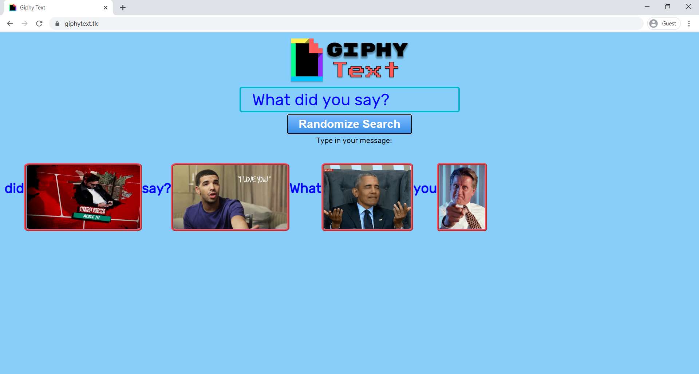
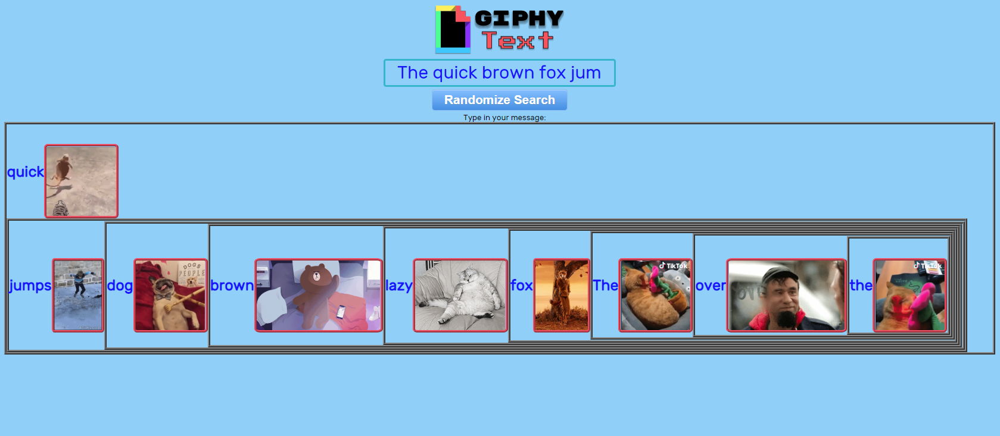
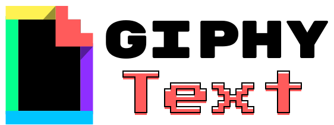

# Chingu Solo Project - Tier 2 - giphy-text


<!--  -->

## To run this project:
* Clone/Download/Fork this repository
* look for the index.html file
* Open with live server or with your file manager 

```bash
$ git clone https://github.com/guitarhub786/giphy-text.git
```
```bash
$ cd giphy-text
```

```bash
$ code . giphy-text
```


## Description:
I followed a simple Giphy Api tutorial (see this repo branch ‘giphy-api-v1’). This app came from an idea that as people send text messages to communicate with each other. I thought, what would it look like if instead of reading a lexical message, how would that message translate and communicate in pictorial form. That’s how the name giphy-text came about. The app might be a little silly and tongue and cheek, but the idea intrigued me. I felt it was an interesting challenge and a unique original idea that I could learn from.  

There are other tutorials like I mentioned about ‘giphy-api-v1’ on Giphy Api, but they all return the same search result each time. What is unique apart from pictorializing text messages, is that I managed to create an algorithm that each time you click the ‘Randomize’ Search button it will randomize the results each time. In the code you could vary the depth of the algorithm so two results will never be the same. 

However, bear in mind that we are also harnessing Giphy’s Api search for the best related result from our search. So, the higher the randomization, the less relevant the pictorial message, which defeats the fun factor of the app. This would also increase processing power and time to calculate and to do all the fetch calls required. Not to mention using up the Giphy Api quota especially if this was a production ready app with many users. I just wanted to create a proof of concept, so I set it fast enough to be fun. Enjoy!

## Function:
* You type in a phrase in the input box and either press ‘enter’ or click on the ‘Randomize Search’ button.
* The phrase is converted into an array and then parsed to fetch the first 20 (manually set in code) searches for each word from the Giphy Api.
  * “What did you say?” -> [‘what’,’did’,’you’,’say?’] -> ‘what’*20 ’did’*20 ’you’*20 ’say?’*20 = 80 Giphy Api calls.
* From the 20 versions of each word we could display, we actually randomize them to choose which version will be displayed so we get varied results.
* The results are then displayed with a set of chained images with its related word next to it. 
* The chain is responsive to your device so if it can’t fit a phrase on the screen, it will wrap and continue on a new line.
* If it is a very long sentence, then the webpage will expand and we need to scroll down to see the rest of the results.
* Finally, we can choose either to keep randomizing the same phrase or enter a new value inside the input box.

## Branches of the versions:
For demonstration and easy reference purposes, I created a Github branch for each version where you can directly view, download or clone the repo.

* giphy-api-v1
* giphy-api-v2
* giphy-api-v3
* giphy-text-v2
* giphy-text-v3
* giphy-text-v4

## Challenges and room for improvement:
* As this was originally a personal challenge, my goal was just a ‘proof of concept’. So, the CSS and structure could be improved.
* The API_KEY is exposed and needs to be hidden behind an environmental variable ‘.env’.  I have spent a lot of time trying to find ways to hide the API_KEY on the front-end browser without the need of the back-end. One of the solutions I came up with was based on recommendation stated by the creator of ‘Codepen’ for using his website. That is to use Local Storage. So I adapted this App (when it was on version giphy-api-v3) just for a proof of concept. Here it is if you want to check it out or use this solution. You will need your own Giphy API_KEY without the quotes.

<a href="https://guitarhub786.github.io/giphy-text-storage/">https://guitarhub786.github.io/giphy-text-storage/</a>

With these non-serious Apps that only needs an email, and the worst that can happen is your monthly quota will run out and you can’t use your app. However, some services require your credit card details in order to get the API_KEY. In the wrong hands this could be quite costly. Personally, I felt that was a shame as there are some great API resources out there that could be use for personal or portfolio projects that could be made with just HTML/CSS/JavaScript you may want to share. The idea of this App is that if there was a popular (or people had) an API_KEY of their own. You could send your Project to anyone on the web and not worry about losing your API_KEY as the user on the other end enters their own API_KEY at the start of the application. 

* I found the CSS and especially challenging trying to get the elements to wrap around challenging as the “HTML” is not all hard-coded and are created dynamically via code into the DOM. This is compounded by the fact that because of the Randomizing of the Algorithm the output display is ‘nested’.


<!--  -->

* Due to the  ‘call-back’ and ‘Async’ nature of this App and the Giphy Api services. The code does not stop when Fetching/Searching/Displaying data. As you see in the sample preview image. The actual order from the text “What did you say?” comes out. “did, say?, What, you”. Maybe a Synchronous solution is better suited for this App.

* Practice using Figma to create a logo and used an online tool to convert .png file to a favicon.ico file.




* Deployed to Netlify
* Aquired a domain name

## Online App link:
* <a href="https://www.giphytext.tk/"> https://www.giphytext.tk/ </a>
* <a href="https://festive-payne-c955e5.netlify.app/">Netlify</a>
* <a href="https://guitarhub786.github.io/giphy-text/">Github</a>

## Contributors:
 * <a href="https://github.com/guitarhub786">Guitarhub786</a>

 
## Technologies used :
HTML, CSS, JavaScript.
 
## Copyright:
A demo project created for educational purpose only.
